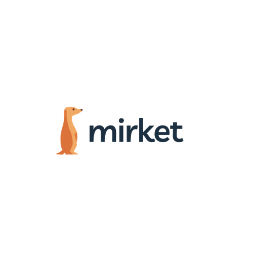

<div align="center">



# Mirket Chat

Self-hostable, real-time chat platform — voice, video, files, communities.

[](LICENSE)
[](https://github.com/unkownpr/mirket-chat/stargazers)
[](https://github.com/unkownpr/mirket-chat/issues)
[](https://github.com/unkownpr/mirket-chat/commits/main)

</div>

---

## About

Mirket Chat is a **self-hosted chat platform** with a Rust backend, a Solid.js web client, and an Electron desktop app. It supports text channels, voice/video (via LiveKit), file uploads, push notifications, and image/link proxying — everything needed to run your own chat community on your own infrastructure.

Mirket is a rebrand and continuation of [Stoat Chat](https://github.com/stoatchat/stoatchat), which itself is a community fork of [Revolt Chat](https://revolt.chat). All upstream contributors are credited; see [Credits](#credits).

## Architecture

This repository is a **monorepo** with four runtime components plus shared brand and a turnkey deployment stack:


| Component | Path | Stack | Description |
| --- | --- | --- | --- |
| **Backend** | [`backend/`](backend/) | Rust 1.86+, MongoDB, Redis, RabbitMQ | REST API (`delta`), WebSocket gateway (`bonfire`), file server (`autumn`), link/image proxy (`january`), GIF proxy (`gifbox`), cron/push daemons. |
| **Web client** | [`web/`](web/) | Solid.js, Vite, pnpm | Browser/PWA client. Talks to backend over REST + WebSocket. |
| **Desktop** | [`desktop/`](desktop/) | Electron, Forge, Vite | Wraps the web client for Windows, macOS, and Linux. |
| **Self-hosted** | [`self-hosted/`](self-hosted/) | Docker Compose, Caddy, LiveKit, MinIO | Single-command stack that wires up backend + web + reverse proxy + storage + voice/video for production. |
| **Assets** | [`assets/`](assets/) | — | Default emoji, icons, and other shared media bundled with the app. |
| **Brand** | [`brand/`](brand/) | — | Mirket logos, lockups, and icon sets in all common sizes. |

## Quick Start (Self-Hosted)

The fastest way to run a full Mirket instance:

```bash
git clone https://github.com/unkownpr/mirket-chat.git
cd mirket-chat/self-hosted

# Copy example env files and adjust to your domain
cp .env.example .env
cp .env.web.example .env.web
cp secrets.env.example secrets.env

# Generate any missing secrets
./generate_config.sh

# Bring everything up
docker compose up -d
```

Then open `http://localhost` (or your `STOAT_DOMAIN`) in a browser.

Full deployment guide — including domain setup, TLS via Caddy, video/voice configuration, and update instructions — lives in [`self-hosted/README.md`](self-hosted/README.md).

## Development

Each component has its own README and toolchain. Pick the one you want to hack on:

- **Backend** — Rust workspace. See [`backend/README.md`](backend/README.md). Uses `mise`, Docker, optionally `mold`.
- **Web** — pnpm workspace, Vite dev server. See [`web/README.md`](web/README.md).
- **Desktop** — Electron Forge, wraps the web build. See [`desktop/README.md`](desktop/README.md).

Required local services for backend dev (MongoDB, Redis, MinIO, RabbitMQ) are defined in `backend/compose.yml`.

## Configuration

Sensitive runtime configuration is **never** committed. Each component ships an example file you copy and edit locally:

| Example file | Purpose |
| --- | --- |
| [`self-hosted/.env.example`](self-hosted/.env.example) | Top-level domain for the compose stack. |
| [`self-hosted/.env.web.example`](self-hosted/.env.web.example) | Public URLs the web client connects to. |
| [`self-hosted/secrets.env.example`](self-hosted/secrets.env.example) | Backend secrets (VAPID, file encryption, LiveKit). Generated by `generate_config.sh` if missing. |
| [`web/packages/client/.env.example`](web/packages/client/.env.example) | Local dev env for the web client (API URLs, hCaptcha sitekey, Sentry DSN). |

Backend defaults live in [`backend/Revolt.toml`](backend/Revolt.toml); LiveKit defaults in [`backend/livekit.example.yml`](backend/livekit.example.yml).

## Brand

All Mirket logos and icon sets are in [`brand/logo/`](brand/logo/):

| File pattern | Use |
| --- | --- |
| `mirket-lockup-*.png` | Horizontal logo + wordmark (use for headers, READMEs, websites). |
| `mirket-icon-*.png` | Square icon (use for app icons, favicons, avatars). |
| `mirket-*.png` | Full mark on transparent background. |

Sizes available: 16, 32, 48, 64, 96, 128, 192, 256, 512, 1024 px.

## License

Mirket Chat is released under the [GNU Affero General Public License v3.0](LICENSE) (AGPLv3), inherited from its upstream projects.

Running a modified version of this software as a network service (e.g. a public Mirket instance) requires you to make the source code of your modifications available to your users.

## Credits

Mirket Chat would not exist without the work of the upstream projects it derives from:

- **[Stoat Chat](https://github.com/stoatchat)** — direct upstream; all backend, web, desktop, and self-hosted code originates here.
- **[Revolt Chat](https://revolt.chat)** — original project Stoat forked from. Many internal config keys still use the `REVOLT__*` prefix for compatibility.

Huge thanks to every contributor of both projects.
